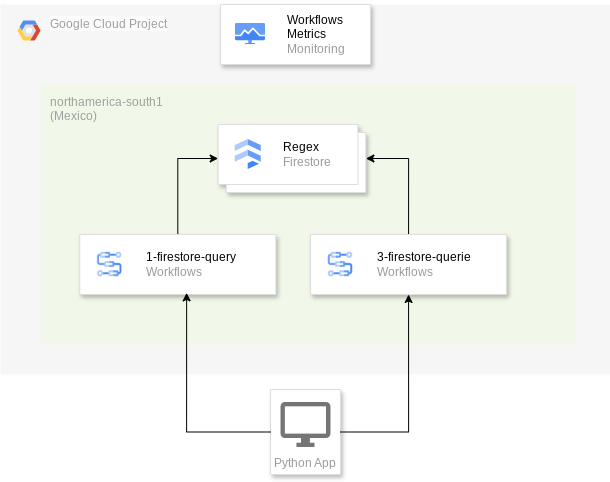
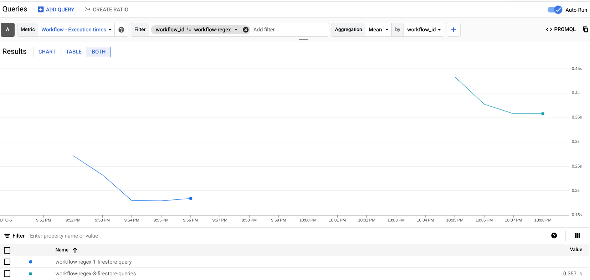

# Google Cloud Workflows Performance Testing with Firestore and Regex

This repository contains code and configurations for performance testing Google Cloud Workflows, specifically focusing on scenarios involving Firestore queries and regular expression (regex) operations. The primary goal is to measure the latency and scalability of workflows when interacting with Firestore and performing data validation via regex.

## Purpose

The purpose of this project is to:

*   Evaluate the performance characteristics of Google Cloud Workflows.
*   Assess the latency when Workflows interact with Firestore databases.
*   Measure the impact of regex operations within Workflow steps.
*   Determine the scalability of the system under different concurrency levels.
*   Demonstrate the low-latency capabilities of Google Cloud Workflows and Firestore.

## Key Technologies

*   **Google Cloud Workflows:** Serverless orchestration platform for automating and coordinating Google Cloud and HTTP-based API services.
*   **Google Cloud Firestore:** A NoSQL document database built for automatic scaling, high performance, and ease of application development.
*   **Regular Expressions (Regex):** Used for pattern matching and data validation within the workflows.
*   **Python:** Used for running the performance tests and orchestrating workflow executions.
*   **Concurrent.futures:** Used to execute workflows with different concurrency levels.
*   **YAML:** Used to define the workflows.

## Design Considerations

Google Cloud Workflows and Firestore are both designed as low-latency, highly scalable solutions. This project aims to demonstrate and validate these characteristics under various load conditions.

*   **Firestore's Low Latency:** Firestore is built for fast read and write operations, even at massive scale. We leverage this by performing document retrieval operations within the workflow.
*   **Workflows' Low Latency:** Workflows are designed to execute quickly and efficiently, minimizing latency in service orchestration.
*   **Regex Validation:** The repository contains several validations to test the performance on that scenario.

## Workflow Implementations

This repository includes the following workflow definitions in YAML format:

*   **`workflow-regex-1-firestore-query.yaml`:** This workflow fetches a single document from Firestore containing regex patterns and validates multiple data points against them (CURP, RFC, and DATE).
*   **`workflow-regex-3-firestore-queries.yaml`:** This workflow performs multiple queries to Firestore (one for each regex type: CURP, RFC, and DATE) before performing validation operations.

Both workflows are focused on validating regex patterns against a set of test data stored within the workflow definition itself.

## HLA



## Performance Testing

The `app.py` file contains the Python code for running performance tests. It uses the `concurrent.futures` library to simulate concurrent workflow executions and measure the overall execution time.

### How to Run Tests

1.  **Set up your Google Cloud Project:**
    *   Ensure you have a Google Cloud project with billing enabled.
    *   Set the `GOOGLE_CLOUD_PROJECT` environment variable to your project ID.
    *   Set the environment variable `LOCATION` with your location.
    * Set the environment variable `WORKFLOW` with the workflow name `workflow-regex-1-firestore-query` or `workflow-regex-3-firestore-queries`
    *   Enable the Workflows and Firestore APIs.
    *   Deploy the workflows defined in the yaml files.
    *   Populate the Firestore with the collections defined in the files, this is the document structure:
        ```
        Collection: regex
        Document: DATE, RFC and CURP, each document should have a key: pattern, with the regex
        Document: VALIDATION should contain three keys: curp, rfc and date, each one with the pattern for validation
        ```

2.  **Install Dependencies:**
    ```bash
    pip install -r requirements.txt
    ```
    The requirements.txt should contain:
    ```
    google-cloud-workflows
    ```

3.  **Run the Performance Test:**
    ```bash
    python app.py
    ```

    This will execute the `app.py` script, which will run the performance test with several concurrency levels.

### Test Concurrency

The `app.py` script tests the following concurrency levels: `[5, 10, 50, 100]`
This concurrency levels will be executed against both workflows. You can modify this value if needed.

### Results

The script will output the following information for each concurrency level:

*   Concurrency level
*   Elapsed time for all executions.
*   Total results: number of workflows executed.

## Considerations

* The script will execute the workflow defined by the enviroment variable: `WORKFLOW`.
* You should change the `PROJECT` and `LOCATION` in the `app.py` if needed.
* The Firestore collection is defined by: `regex`.
* The regex values are defined by this document: `CURP, RFC and DATE`.
* The validation document is: `VALIDATION`.
* Remember to populate the firestore collection before running the tests.

## Results

The performance tests were conducted using Google Cloud's `northamerica-south1` (Mexico) region for both Firestore and Workflows. A dedicated Service Account was created and used to execute the workflows.
The tests were executed with different concurrency levels for both workflows.

**workflow-regex-3-firestore-queries:**

*   Mean latency across all executions: **0.357 seconds**.
*   Slowest individual execution (likely the first one, indicating a cold start): **1.072 seconds**.

**workflow-regex-1-firestore-query:**

*   Mean latency across all executions: **0.184 seconds**.
*   Slowest individual execution (likely the first one, indicating a cold start): **0.405 seconds**.



## Conclusions

The results clearly demonstrate the low-latency nature of Google Cloud Workflows and Firestore. Key observations include:

*   **Impact of Multiple Firestore Queries:** The `workflow-regex-3-firestore-queries`, which performs three separate Firestore queries, exhibits a higher mean latency (0.376s) compared to the `workflow-regex-1-firestore-query` (0.184s), which executes only one query. This demonstrates that the number of Firestore interactions directly influences overall latency, although the impact is still relatively low.
*   **Cold Start:** Both workflows experienced a slower initial execution (1.072s and 0.405s respectively), which is indicative of a cold start. Subsequent executions were significantly faster, confirming that the cold start penalty is minimal.
*   **Low Latency Solution:** Even with the overhead of regex operations and multiple Firestore queries, the workflows consistently achieved sub-second average latencies, highlighting that both Workflows and Firestore are effective low-latency solutions.
*   **High Concurrency:** No significant degradation in performance was observed under high concurrency, suggesting that the system can handle a substantial workload without impacting latency. This indicates the scalability of both Workflows and Firestore.

These tests confirm that Google Cloud Workflows and Firestore are powerful tools for building applications that require low latency and high concurrency, even when performing data validation via regex and interacting with data in Firestore.
