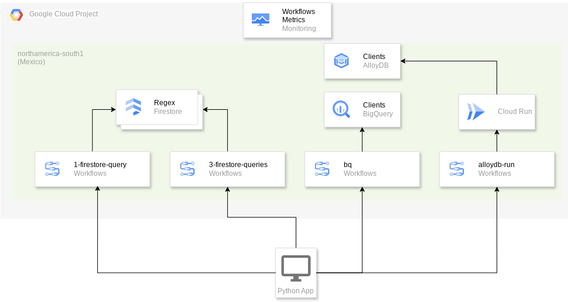
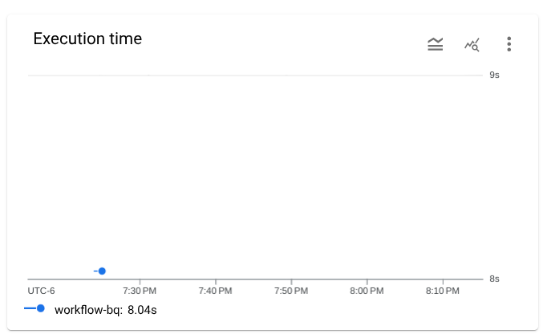
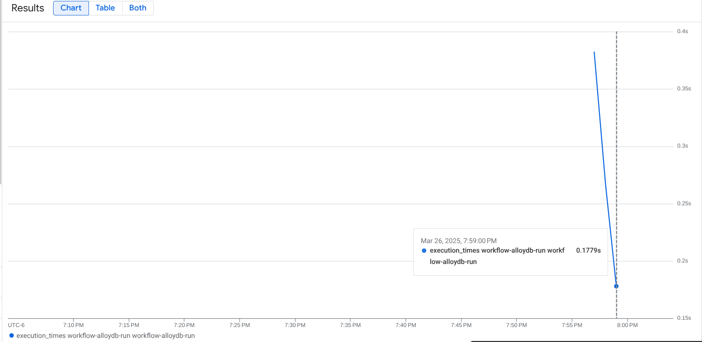

# Google Cloud Workflows Performance Testing with Firestore, BigQuery, AlloyDB, and Regex

This repository contains code and configurations for performance testing Google Cloud Workflows, specifically focusing on scenarios involving Firestore queries, BigQuery updates, AlloyDB updates (via Cloud Run), and regular expression (regex) operations. The primary goal is to measure the latency and scalability of workflows when interacting with these different services and performing data validation via regex.

## Purpose

The purpose of this project is to:

*   Evaluate the performance characteristics of Google Cloud Workflows.
*   Assess the latency when Workflows interact with Firestore databases.
*   Measure the latency when Workflows interact with BigQuery for updates.
*   Measure the latency when Workflows interact with AlloyDB via a Cloud Run service for updates.
*   Measure the impact of regex operations within Workflow steps.
*   Determine the scalability of the system under different concurrency levels.
*   Demonstrate the low-latency capabilities of Google Cloud Workflows and its integration with various Google Cloud services.
*   Compare the performance of different database interactions (Firestore, BigQuery, AlloyDB) within Workflows.

## Key Technologies

*   **Google Cloud Workflows:** Serverless orchestration platform for automating and coordinating Google Cloud and HTTP-based API services.
*   **Google Cloud Firestore:** A NoSQL document database built for automatic scaling, high performance, and ease of application development.
*   **Google Cloud BigQuery:** A serverless, highly scalable, and cost-effective multi-cloud data warehouse designed for business agility.
*   **Google Cloud AlloyDB:** A fully managed, PostgreSQL-compatible database service for demanding transactional workloads.
*   **Google Cloud Run:** A fully managed compute platform for deploying and scaling containerized applications.
*   **Regular Expressions (Regex):** Used for pattern matching and data validation within the workflows.
*   **Python:** Used for running the performance tests and orchestrating workflow executions.
*   **Concurrent.futures:** Used to execute workflows with different concurrency levels.
*   **YAML:** Used to define the workflows.

## Design Considerations

Google Cloud Workflows, Firestore, BigQuery, and AlloyDB are all designed as highly scalable solutions. This project aims to demonstrate and validate these characteristics under various load conditions. It also highlights the differences in performance when interacting with different database types.

*   **Firestore's Low Latency:** Firestore is built for fast read and write operations, even at massive scale. We leverage this by performing document retrieval operations within the workflow.
*   **BigQuery's Analytical Focus:** BigQuery is optimized for analytical queries and data warehousing, not for low-latency, single-record updates. This test demonstrates the performance characteristics of using BigQuery for updates within a workflow.
*   **AlloyDB's Transactional Performance:** AlloyDB is designed for transactional workloads and offers significantly lower latency for single-record updates compared to BigQuery. This test demonstrates the performance characteristics of using AlloyDB for updates within a workflow via a Cloud Run service.
*   **Workflows' Low Latency:** Workflows are designed to execute quickly and efficiently, minimizing latency in service orchestration.
*   **Regex Validation:** The repository contains several validations to test the performance on that scenario.

## Workflow Implementations

This repository includes the following workflow definitions in YAML format:

*   **`workflow-regex-1-firestore-query.yaml`:** This workflow fetches a single document from Firestore containing regex patterns and validates multiple data points against them (CURP, RFC, and DATE).
*   **`workflow-regex-3-firestore-queries.yaml`:** This workflow performs multiple queries to Firestore (one for each regex type: CURP, RFC, and DATE) before performing validation operations.
*   **`workflow-bigquery-update.yaml`:** This workflow receives a `clientID`, queries a BigQuery table, and updates a specific record with a new base64 encoded string.
*   **`workflow-alloydb-update.yaml`:** This workflow receives a `clientID`, calls a Cloud Run service, which in turn queries an AlloyDB table and updates a specific record with a new base64 encoded string.

The regex workflows are focused on validating regex patterns against a set of test data stored within the workflow definition itself. The BigQuery and AlloyDB workflows are focused on updating a record in the database.

## HLA



## Performance Testing

The `app.py`, `bq.py` and `alloydb.py` files contain the Python code for running performance tests. They use the `concurrent.futures` library to simulate concurrent workflow executions and measure the overall execution time.

### How to Run Tests

1.  **Set up your Google Cloud Project:**
    *   Ensure you have a Google Cloud project with billing enabled.
    *   Set the `GOOGLE_CLOUD_PROJECT` environment variable to your project ID.
    *   Set the environment variable `LOCATION` with your location.
    * Set the environment variable `WORKFLOW` with the workflow name (`workflow-regex-1-firestore-query`, `workflow-regex-3-firestore-queries`, `workflow-bigquery-update` or `workflow-alloydb-update`).
    *   Enable the Workflows, Firestore, BigQuery, AlloyDB, and Cloud Run APIs.
    *   Deploy the workflows defined in the yaml files.
    *   Populate the Firestore, BigQuery and AlloyDB with the collections/tables defined in the files.
        *   **Firestore:**
            ```
            Collection: regex
            Document: DATE, RFC and CURP, each document should have a key: pattern, with the regex
            Document: VALIDATION should contain three keys: curp, rfc and date, each one with the pattern for validation
            ```
        *   **BigQuery:** Create a table with at least two columns: `clientID` and `base64`.
        *   **AlloyDB:** Create a table with at least two columns: `clientID` and `base64`.
    * Deploy the Cloud Run service that will interact with AlloyDB.

2.  **Install Dependencies:**
    ```bash
    pip install -r requirements.txt
    ```
    The `requirements.txt` should contain:
    ```
    google-cloud-workflows
    google-cloud-bigquery
    google-cloud-alloydb
    ```

3.  **Run the Performance Test:**
    ```bash
    python app.py
    python bq.py
    python alloydb.py
    ```

    This will execute the scripts, which will run the performance test with several concurrency levels.

### Test Concurrency

The scripts test the following concurrency levels: `[5, 10, 50, 100]`. This concurrency levels will be executed against all workflows. You can modify this value if needed.

### Results

The script will output the following information for each concurrency level:

*   Concurrency level
*   Elapsed time for all executions.
*   Total results: number of workflows executed.

## Considerations

*   The script will execute the workflow defined by the environment variable: `WORKFLOW`.
*   You should change the `PROJECT` and `LOCATION` in the `app.py`, `bq.py` and `alloydb.py` if needed.
*   **Firestore:**
    *   The Firestore collection is defined by: `regex`.
    *   The regex values are defined by this document: `CURP, RFC and DATE`.
    *   The validation document is: `VALIDATION`.
*   **BigQuery:**
    * The table name is defined in the `bq.py` file.
    * The table should have at least two columns: `clientID` and `base64`.
*   **AlloyDB:**
    * The table name is defined in the `alloydb.py` file.
    * The table should have at least two columns: `clientID` and `base64`.
*   Remember to populate the Firestore, BigQuery and AlloyDB collections/tables before running the tests.
* The Cloud Run service should be deployed and configured to interact with AlloyDB.

## Results

The performance tests were conducted using Google Cloud's `northamerica-south1` (Mexico) region for all services. A dedicated Service Account was created and used to execute the workflows.
The tests were executed with different concurrency levels for all workflows.

| Workflow                                  | Mean Latency (seconds) | Slowest Execution (seconds) | Notes                                                                                                |
| ----------------------------------------- | ---------------------- | --------------------------- | ---------------------------------------------------------------------------------------------------- |
| `workflow-regex-3-firestore-queries`      | 0.357                  | 1.072                       | Multiple Firestore queries (3).                                                                       |
| `workflow-regex-1-firestore-query`       | 0.184                  | 0.405                       | Single Firestore query.                                                                               |
| `workflow-bigquery-update`                | 8.04                   | 10.637                      | BigQuery update operation.                                                                            |
| `workflow-alloydb-update`                 | 0.178                  | 0.93                        | AlloyDB update via Cloud Run service. Includes connection pool initialization in the first execution. |

### Firestore execution time graph


### BigQuery execution time graph



### AlloyDB execution time graph



## Conclusions

The results clearly demonstrate the performance characteristics of Google Cloud Workflows when interacting with different services. Key observations include:

*   **Impact of Multiple Firestore Queries:** The `workflow-regex-3-firestore-queries`, which performs three separate Firestore queries, exhibits a higher mean latency (0.357s) compared to the `workflow-regex-1-firestore-query` (0.184s), which executes only one query. This demonstrates that the number of Firestore interactions directly influences overall latency, although the impact is still relatively low.
*   **Cold Start:** All workflows experienced a slower initial execution, which is indicative of a cold start. Subsequent executions were significantly faster, confirming that the cold start penalty is minimal.
*   **Low Latency Solution (Firestore):** Even with the overhead of regex operations and multiple Firestore queries, the workflows consistently achieved sub-second average latencies, highlighting that both Workflows and Firestore are effective low-latency solutions.
*   **BigQuery Update Performance:** The BigQuery update workflow demonstrates higher latency compared to Firestore and AlloyDB, which is expected due to BigQuery's design for analytical workloads rather than low-latency updates.
*   **AlloyDB Update Performance:** The AlloyDB update workflow, even with the added overhead of a Cloud Run service, exhibits significantly lower latency than BigQuery, highlighting its suitability for transactional workloads.
*   **High Concurrency:** No significant degradation in performance was observed under high concurrency, suggesting that the system can handle a substantial workload without impacting latency. This indicates the scalability of Workflows, Firestore, BigQuery and AlloyDB.
* **Database Selection:** The choice of database significantly impacts the overall latency of the workflow. Firestore and AlloyDB are suitable for low-latency operations, while BigQuery is better suited for analytical tasks.

These tests confirm that Google Cloud Workflows is a powerful tool for building applications that require low latency and high concurrency, even when performing data validation via regex and interacting with data in different databases. The choice of database should be carefully considered based on the specific performance requirements of the application.
